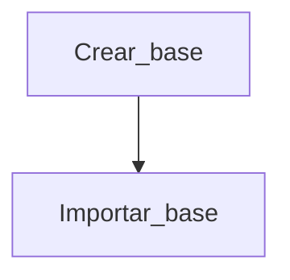

# bdatos
Base de datos configurable

## Crear base

\[\[2023-02-03 17_33_05-Base de datos.png\]\]
Especifica el nombre de la base y el número de decimales que deben tener los campos numéricos.
Tienes disponibles hasta 20 campos para crear la base. En cada uno de los campos podrás escribir el nombre del campo, que aparecerá en la base, el tipo de campo y si es numérico, si quieres que lo sume y haga la media.
También puedes añadir un comentario que aparecerá junto al nombre de la base de datos.
\[\[2023-02-05 10_17_20-Crea Base de datos.png\]\]

## Importar base

\[\[2023-02-03 17_33_52-Base de datos.png\]\]

1.  Crea una base de datos con los campos y características de la base que necesitas importar.
2.  Al mostrar la vista de tabla de la base verás que está vacía y abajo aparece el icono de importar
    \[\[2023-02-03 17_49_23-Base de datos.png\]\]
3.  Importa la base en el formato especificado más abajo

Ejemplo
Si defines la base de datos creada con estos datos:

| FECHA | CONCEPTO | COSTE | NOTAS | FOTO |
|:------|:---------|:------|:------|:-----|

La base de datos a importar deberá ser un archivo .csv y tener esta estructura:
FECHA;CONCEPTO;COSTE;NOTAS;FOTO
2023-01-19;prime;33;pa que lo quieres;upload/01 Aiptek.jpg
2003-07-18;segun;24;kuku
2023-01-24;terce;77



## Vista de en modo tabla

\[\[2023-02-03 18_15_41-Base de datos.png\]\]

Se trata de la vista por defecto de la base de datos. Tocando en cualquier campo aparecerá la ficha completa del registro.

Para ordenar la base de datos toca sobre el nombre del campo por el que ordenar .
\[\[2023-02-03 18_13_44-Base de datos.png\]\]

Añadir registros: \[\[2023-02-03 17_55_22-Base de datos.png\]\]
Mostrar/ocultar imágenes: \[\[2023-02-03 18_05_00-Base de datos 1.png\]\]
Descargar base en formato .csv: \[\[2023-02-03 18_11_19-Base de datos.png\]\]
Buscar registro: \[\[2023-02-03 18_14_55-Base de datos.png\]\]

## Vista en modo ficha

Descargar registro: \[\[2023-02-03 18_17_14-Base de datos.png\]\]. El registro se descarga como imagen.
Modificar registro: \[\[2023-02-03 18_17_19-Base de datos.png\]\] \[\[2023-02-03 18_18_26-Base de datos.png\]\]
Avanzar/retroceder registro: \[\[2023-02-03 18_17_28-Base de datos.png\]\]

\[\[2023-02-03 18_17_35-Base de datos.png\]\]

------------------------------------------------------------------------

## Estructura y archivos de la base

base.csv
1;2023-01-19;prime;33;pa que lo quieres;upload/01 Aiptek.jpg
2;2003-07-18;segun;24;kuku;
3;2023-01-24;terce;77;;

base.php

``` php
<?php

$mibase="bases/Combustible";
$deci="2";
$come="Gasto de combustible 2023";

$col[1]="Fecha";
$tip[1]="date";
$sum[1]="";
$med[1]="";

$col[2]="Litros";
$tip[2]="number";
$sum[2]="si";
$med[2]="si";

$col[3]="Importe";
$tip[3]="number";
$sum[3]="si";
$med[3]="si";

$col[4]="Vehiculo";
$tip[4]="text";
$sum[4]="";
$med[4]="";

?>
```

## constantes.php

``` php
<?php
$nom="Base de datos";       // NOMBRE DE LA PLICACION
$log="favicon.png";         // ICONO
$img="foto04.png";          // FONDO DE LA PANTALLA DE ACCESO
$anchoimg="100px";          // ANCHO DE LAS IMAGENES EN LA TABLA DE REGISTROS
$altoimg="100px";           // ALTO DE LAS IMAGENES EN LA TABLA DE REGISTROS
$imgtabla="";               // CON si, MUESTRA LAS FOTOS EN LA TABLA DE REGISTROS (Esto puede ralentizar la aparición de la tabla de datos)
$numcampos=20;              // NUMERO DE CAMPOS MÁXIMO
$colo="#bbd7cf";
?>
```
